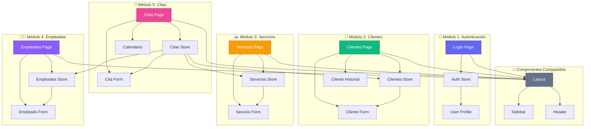
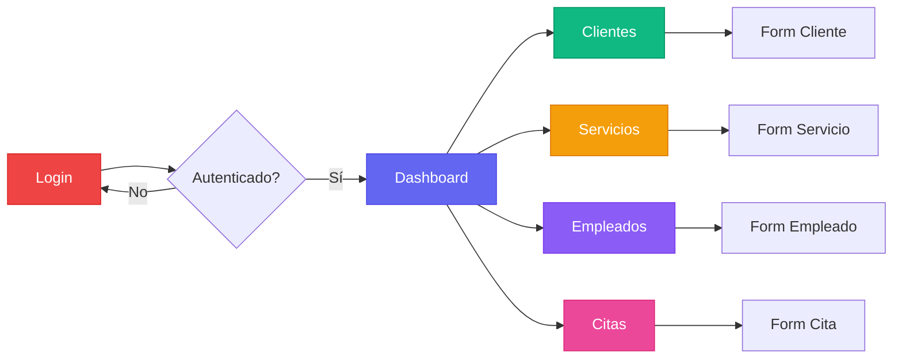
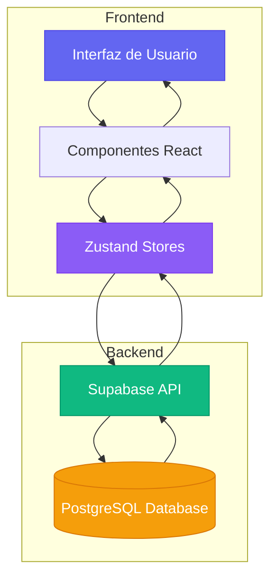
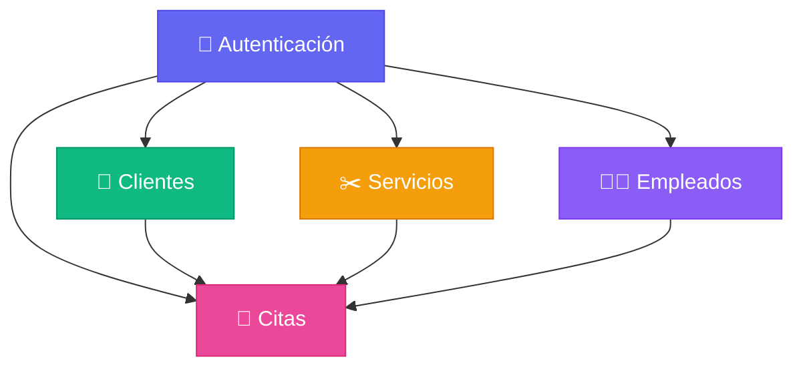
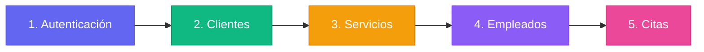
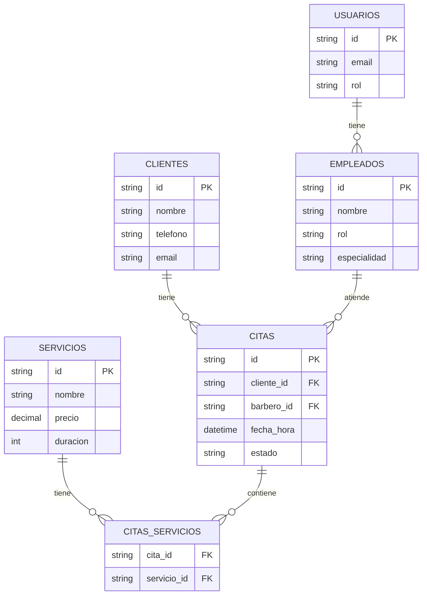

# 📊 Diagrama de Módulos del Sistema de Barbería

## 🏗️ Arquitectura de Módulos



## 📱 Estructura de Páginas y Navegación



## 🔄 Flujo de Datos



## 📂 Estructura de Archivos por Módulo

```
frontend/src/
├── 📁 pages/
│   ├── Login.tsx                    # 🔐 Módulo 1
│   ├── Dashboard.tsx
│   ├── Clientes.tsx                 # 👥 Módulo 2
│   ├── Servicios.tsx                # ✂️ Módulo 3
│   ├── Empleados.tsx                # 👨‍💼 Módulo 4
│   └── Citas.tsx                    # 📅 Módulo 5
│
├── 📁 components/
│   ├── Layout.tsx                   # 🎨 Compartido
│   ├── Sidebar.tsx                  # 🎨 Compartido
│   ├── Header.tsx                   # 🎨 Compartido
│   ├── ClienteForm.tsx              # 👥 Módulo 2
│   ├── ClienteHistorial.tsx         # 👥 Módulo 2
│   ├── ServicioForm.tsx             # ✂️ Módulo 3
│   ├── EmpleadoForm.tsx             # 👨‍💼 Módulo 4
│   └── CitaForm.tsx                 # 📅 Módulo 5
│
├── 📁 stores/
│   ├── authStore.ts                 # 🔐 Módulo 1
│   ├── clientesStore.ts             # 👥 Módulo 2
│   ├── serviciosStore.ts            # ✂️ Módulo 3
│   ├── empleadosStore.ts            # 👨‍💼 Módulo 4
│   └── citasStore.ts                # 📅 Módulo 5
│
└── 📁 lib/
    └── supabase.ts                  # 🔧 Compartido
```

## 🎯 Dependencias entre Módulos



## 📋 Orden de Implementación



## 🔑 Funcionalidades por Módulo

### 🔐 Módulo 1: Autenticación
- ✅ Login/Logout
- ✅ Gestión de sesión
- ✅ Roles (Admin, Barbero, Recepcionista)
- ✅ Protección de rutas

### 👥 Módulo 2: Clientes
- ✅ CRUD completo
- ✅ Búsqueda
- ✅ Historial de citas
- ✅ Información de contacto

### ✂️ Módulo 3: Servicios
- ✅ CRUD completo
- ✅ Precios y duración
- ✅ Categorías
- ✅ Activar/Desactivar

### 👨‍💼 Módulo 4: Empleados
- ✅ CRUD completo
- ✅ Asignación de roles
- ✅ Especialidades
- ✅ Estado activo/inactivo

### 📅 Módulo 5: Citas
- ✅ Crear/Editar/Cancelar
- ✅ Calendario diario/semanal
- ✅ Asignar barbero
- ✅ Seleccionar servicios
- ✅ Estados de cita
- ✅ Notas

## 🎨 Componentes Compartidos

- **Layout**: Estructura principal de la app
- **Sidebar**: Navegación lateral
- **Header**: Barra superior con búsqueda y usuario
- **Form Components**: Formularios reutilizables

## 📊 Base de Datos (Supabase)


