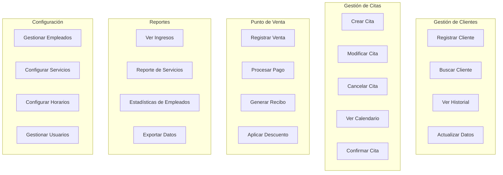
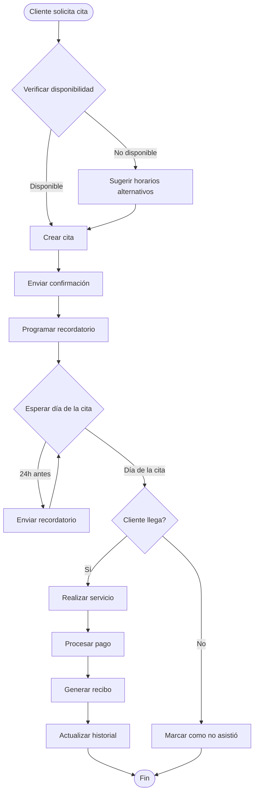

# Diagrama UML - Sistema de Gestión de Barbería

## Diagrama de Clases Simplificado

```mermaid
classDiagram
    %% Módulo de Clientes
    class Cliente {
        -int id
        -string nombre
        -string telefono
        -string email
        -Date fechaNacimiento
        -Date fechaRegistro
        -string notas
        -string preferencias
        -boolean activo
        +crear()
        +actualizar()
        +eliminar()
        +buscar()
        +obtenerHistorial()
    }
    
    class HistorialCliente {
        -int id
        -int clienteId
        -Date fechaServicio
        -int servicioId
        -int barberoId
        -decimal precio
        -string notas
        +agregarRegistro()
        +obtenerRegistros()
    }
    
    %% Módulo de Citas
    class Cita {
        -int id
        -int clienteId
        -int barberoId
        -DateTime fechaHora
        -int duracion
        -EstadoCita estado
        -List~Servicio~ servicios
        -string notas
        -DateTime fechaCreacion
        +crear()
        +modificar()
        +cancelar()
        +confirmar()
        +completar()
    }
    
    class EstadoCita {
        <<enumeration>>
        PENDIENTE
        CONFIRMADA
        EN_PROCESO
        COMPLETADA
        CANCELADA
        NO_ASISTIO
    }
    
    class Calendario {
        -Date fecha
        -int barberoId
        +obtenerDisponibilidad()
        +bloquearHorario()
        +liberarHorario()
        +obtenerCitasDelDia()
    }
    
    class Recordatorio {
        -int id
        -int citaId
        -TipoRecordatorio tipo
        -boolean enviado
        -DateTime fechaEnvio
        +enviarSMS()
        +enviarEmail()
        +programar()
    }
    
    %% Módulo de Servicios
    class Servicio {
        -int id
        -string nombre
        -string descripcion
        -decimal precio
        -int duracion
        -boolean activo
        -string categoria
        +crear()
        +actualizar()
        +eliminar()
        +obtenerPrecio()
    }
    
    class Paquete {
        -int id
        -string nombre
        -string descripcion
        -decimal precio
        -List~Servicio~ servicios
        -decimal descuento
        +crear()
        +calcularPrecio()
    }
    
    class Promocion {
        -int id
        -string nombre
        -TipoDescuento tipo
        -decimal valor
        -Date fechaInicio
        -Date fechaFin
        -boolean activa
        +aplicar()
        +validarVigencia()
    }
    
    %% Módulo de Empleados
    class Empleado {
        -int id
        -string nombre
        -string telefono
        -string email
        -Rol rol
        -Date fechaContratacion
        -boolean activo
        -decimal porcentajeComision
        +crear()
        +actualizar()
        +obtenerHorario()
        +calcularComision()
    }
    
    class HorarioEmpleado {
        -int id
        -int empleadoId
        -DiaSemana diaSemana
        -Time horaInicio
        -Time horaFin
        -boolean activo
        +obtenerHorario()
        +actualizarHorario()
    }
    
    class RendimientoEmpleado {
        -int id
        -int empleadoId
        -Date fecha
        -int serviciosRealizados
        -decimal ingresosGenerados
        -decimal comisiones
        +calcularRendimiento()
        +obtenerEstadisticas()
    }
    
    %% Módulo de Punto de Venta
    class Venta {
        -int id
        -int citaId
        -int clienteId
        -DateTime fecha
        -decimal subtotal
        -decimal descuento
        -decimal impuesto
        -decimal total
        -MetodoPago metodoPago
        -decimal propina
        -EstadoVenta estado
        +crear()
        +calcularTotal()
        +aplicarDescuento()
        +procesarPago()
    }
    
    class ItemVenta {
        -int id
        -int ventaId
        -int servicioId
        -int cantidad
        -decimal precioUnitario
        -decimal subtotal
    }
    
    class Recibo {
        -int id
        -int ventaId
        -string numeroRecibo
        -DateTime fechaEmision
        -string contenido
        +generarPDF()
        +imprimir()
        +enviarPorEmail()
    }
    
    %% Módulo de Reportes
    class Reporte {
        -int id
        -TipoReporte tipo
        -Date fechaInicio
        -Date fechaFin
        -JSON datos
        +generar()
        +exportarPDF()
        +exportarExcel()
    }
    
    class Estadistica {
        -Periodo periodo
        -decimal ingresos
        -int serviciosRealizados
        -int clientesAtendidos
        -decimal promedioTicket
        +calcular()
        +obtenerGraficos()
    }
    
    %% Módulo de Configuración
    class Usuario {
        -int id
        -int empleadoId
        -string username
        -string password
        -Rol rol
        -boolean activo
        -DateTime ultimoAcceso
        +autenticar()
        +cambiarPassword()
        +obtenerPermisos()
    }
    
    class Configuracion {
        -int id
        -string clave
        -string valor
        -TipoConfiguracion tipo
        +obtener()
        +actualizar()
    }
    
    %% Relaciones
    Cliente ||--o{ HistorialCliente : tiene
    Cliente ||--o{ Cita : reserva
    Cliente ||--o{ Venta : realiza
    
    Empleado ||--o{ Cita : atiende
    Empleado ||--o{ HorarioEmpleado : tiene
    Empleado ||--o{ RendimientoEmpleado : genera
    Empleado ||--|| Usuario : tiene
    
    Cita ||--o{ Venta : genera
    Cita ||--o{ Recordatorio : tiene
    Cita }o--o{ Servicio : incluye
    Cita }o--|| EstadoCita : tiene
    
    Servicio ||--o{ ItemVenta : contiene
    Servicio }o--o{ Paquete : incluye
    
    Venta ||--|| Recibo : genera
    Venta ||--o{ ItemVenta : contiene
    
    Calendario }o--|| Empleado : pertenece
    Calendario ||--o{ Cita : muestra
    
    Promocion ..> Venta : aplica
    
    Reporte ..> Venta : analiza
    Reporte ..> Cita : analiza
    Reporte ..> Empleado : analiza
    Estadistica ..> Reporte : genera
```

## Diagrama de Casos de Uso



## Diagrama de Flujo - Proceso de Cita


