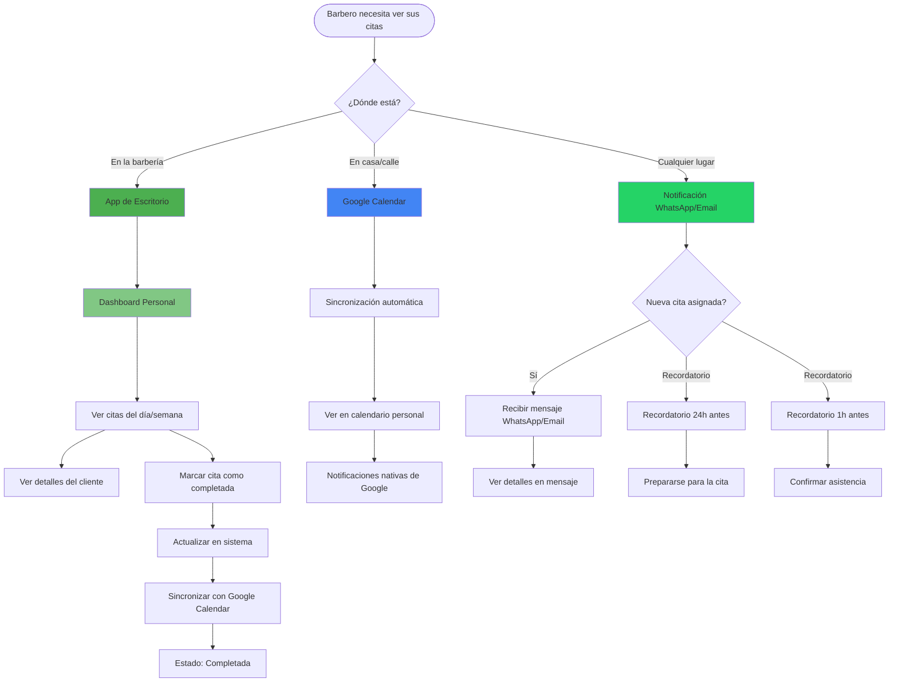
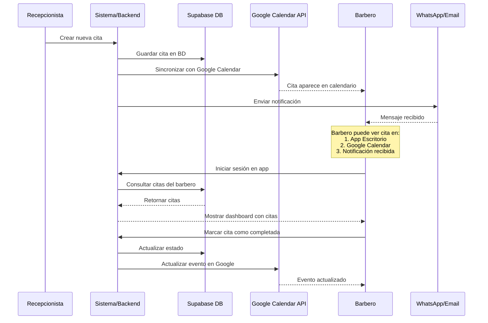
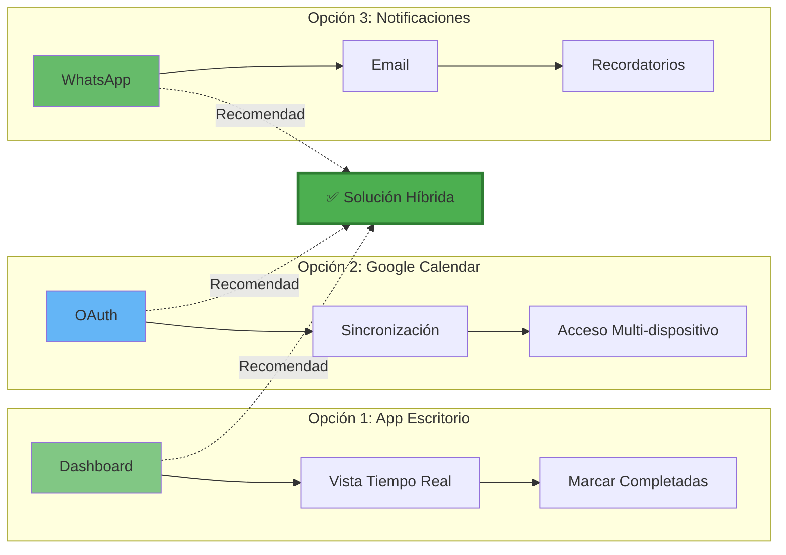
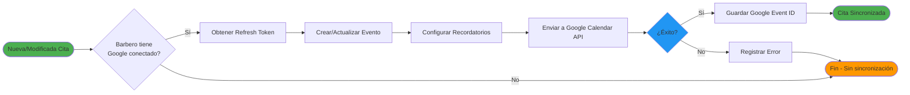
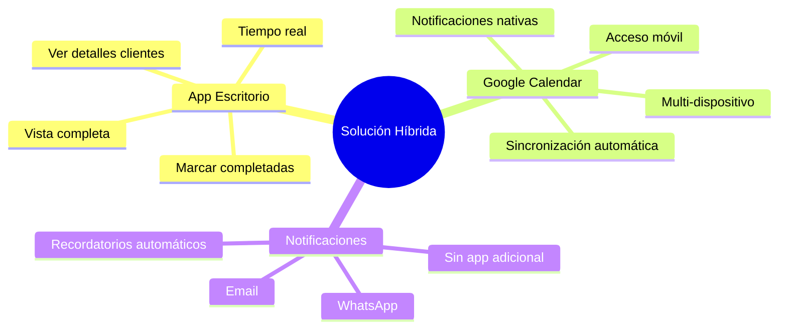

# Flujo de Acceso de Barberos a sus Citas

## Diagrama de Flujo - Solución Híbrida Recomendada

## Arquitectura de Sincronización

## Comparación Visual de Opciones

## Flujo de Sincronización con Google Calendar

## Ventajas de la Solución Híbrida

